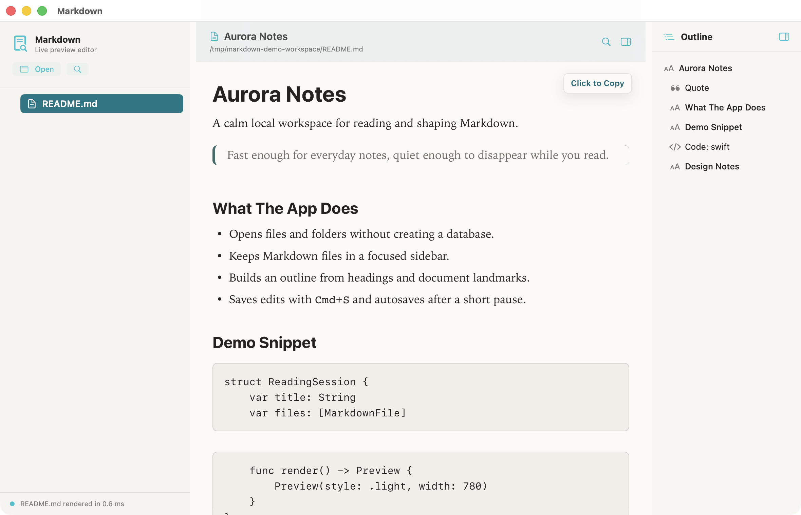

# Markdown

A fast, quiet, macOS-native Markdown reader and live-preview editor for local files and folders.

Markdown is built for people who want a lightweight desktop app for reading and making small edits to Markdown without turning their notes into a database. It opens individual `.md` / `.markdown` files, opens folders as navigable workspaces, renders CommonMark-style Markdown by default, and keeps the interface intentionally small.



## Features

- Native SwiftUI macOS app with a light-only MVP design.
- WebView-backed Markdown preview with app-owned typography, spacing, tables, code blocks, links, and images.
- Open a single Markdown file or a folder workspace.
- Collapsible sidebar tree for folders and Markdown files.
- Current-document search, workspace search, and a right-side document outline.
- Live-preview editing with `Cmd+S` save, debounced autosave, undo/redo, list continuation, and inline formatting shortcuts.
- File watching for selected-file refresh, folder additions/deletions, and selected-file rename/delete recovery.
- No plugins, sync, graph view, backlinks, wiki links, hidden indexing, or persistent database.

## Download

The 0.1 release provides a downloadable macOS app bundle zip from GitHub Releases.

Requirements:

- macOS 14 Sonoma or newer.
- Apple Silicon build for the current 0.1 artifact.

Install:

1. Download `Markdown-0.1.0-macos-arm64.zip` from the latest release.
2. Unzip it.
3. Move `Markdown.app` to `/Applications`.
4. Open it from Finder, Spotlight, or Launchpad.

The 0.1 artifact is ad-hoc signed so the app bundle verifies on disk, but it is not yet Developer ID signed or notarized. Depending on Gatekeeper settings, macOS may ask you to confirm the first launch from Finder. Developer ID signing and notarization are tracked as distribution hardening work.

## Build From Source

Build and test:

```sh
./scripts/test-macos.sh
./scripts/build-macos-app.sh
```

Install locally:

```sh
./scripts/install-macos-app.sh
```

Update a local install to the latest GitHub commit:

```sh
./scripts/update-to-latest-commit.sh
```

The update helper fetches the latest commit from `origin`'s default branch, builds it in a temporary worktree, and installs the rebuilt app to `/Applications/Markdown.app` without changing your active checkout. Use `--run-tests` to run the Swift tests before installation, `--open` to launch the installed app, or `--branch main` to rebuild a specific remote branch.

Run with a folder:

```sh
./scripts/run-macos.sh spikes/spike1-rendering-engine/fixtures
```

The local release app bundle is generated at `artifacts/Markdown.app`.

## Security And Privacy

Markdown is local-first: it opens files and folders you choose and does not maintain a background index or sync service. The 0.1 renderer supports common Markdown only; raw HTML in Markdown files is rendered as text so arbitrary `<script>` or event-handler HTML cannot run in the preview. Clicked links open externally only for `http` and `https`.

See [`SECURITY.md`](SECURITY.md) for reporting guidance and [`docs/Security-Review-0.1.md`](docs/Security-Review-0.1.md) for the 0.1 security review notes.

## Documentation

| File | What it covers |
|---|---|
| [`docs/Product-Design.md`](docs/Product-Design.md) | Product vision, MVP scope, UX principles, and quality bar |
| [`docs/Engineering-Standards.md`](docs/Engineering-Standards.md) | Code quality, architecture, testing, performance, and docs rules |
| [`docs/Progress.md`](docs/Progress.md) | Completed capabilities, implementation lessons, and deferred product work |
| [`docs/Build-Plan.md`](docs/Build-Plan.md) | Initial architecture plan and sequencing |
| [`docs/Architecture-Decisions.md`](docs/Architecture-Decisions.md) | Durable decisions and pending ADRs |
| [`docs/Project-Structure.md`](docs/Project-Structure.md) | Intended repository layout and ownership boundaries |
| [`docs/Next-Steps.md`](docs/Next-Steps.md) | Forward-looking planning backlog |
| [`docs/Handoff.md`](docs/Handoff.md) | Minimal load order for future sessions |
| [`docs/Validation.md`](docs/Validation.md) | Latest build/test/screenshot validation notes |
| [`spikes/README.md`](spikes/README.md) | Technical spike index |
