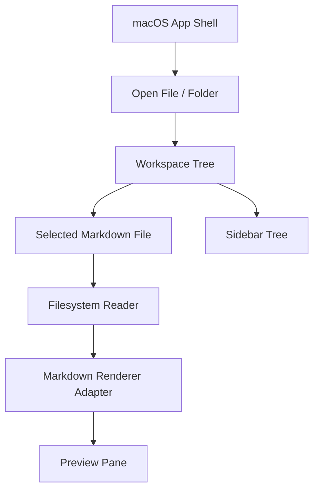

# Build Plan

This is the condensed architecture plan for the first usable version.

## Decision

Build a private macOS Markdown reader that opens files and folders and renders Markdown in preview mode by default.

The first spike recommends a WebView-backed renderer for MVP. The rest of the architecture should still keep rendering behind an adapter:

- App shell owns windows, commands, and open/recent-document flows.
- Workspace model owns folder trees, expansion state, and selected files.
- Filesystem layer owns scanning, filtering, and file reads.
- Markdown layer owns parser/renderer adapters.
- Preview layer displays rendered content.

## Architecture



## Initial Repository Shape

```text
markdown/
├── README.md
├── docs/
├── spikes/
├── apps/
│   └── macos/
└── packages/        # only when justified
```

## MVP Slices

### Slice 0: Rendering Engine Spike

Status: complete. Spike 1 recommends WebView-backed rendering for MVP.

Outcome:

- recommended renderer path: `WKWebView` with local generated HTML/CSS
- measured tradeoffs recorded in `spikes/spike1-rendering-engine/RESULTS.md`
- ADR 005 updated
- production implementation notes recorded in the spike

### Slice 1: App Skeleton

Status: complete for first MVP slice.

- Create macOS app target under `apps/macos`.
- Add app/window shell.
- Add empty, single-file, and folder-open states.
- Add basic diagnostics for render and file-open timings.

### Slice 2: Filesystem And Sidebar

Status: complete for first MVP slice.

- Open a folder.
- Build a collapsible tree of folders and `.md`/`.markdown` files.
- Ignore hidden/system noise by default.
- Select files and update preview state.
- Handle unreadable files without crashing.

### Slice 3: Markdown Preview

Status: complete for first MVP slice.

- Implement the WebView-backed renderer adapter.
- Generate semantic HTML from parsed Markdown.
- Load local HTML/CSS into `WKWebView`.
- Keep JavaScript disabled unless explicitly justified.
- Force a light-only preview theme for MVP.
- Tune CSS for fonts, tighter spacing, readable width, links, tables, and code blocks.
- Render common Markdown fixtures.
- Support local images where safe.
- Add large-file smoke coverage.

### Slice 4: Native Polish

Status: mostly complete for the reader MVP foundation.

Complete:

- Light-only visual design.
- Screenshot-based visual QA for folder and single-file flows.
- Empty/error states.
- Unified open command.
- Recent files/folders.
- Last-open restoration.
- Selected-file live refresh.
- Folder-level file watching.
- Current-document search.
- Right-side document outline.
- Pane visibility and size persistence.
- App-level command-arrow routing.
- Keyboard shortcuts help.
- Lightweight CPU/RSS status readout.
- Release CPU/RSS profiling script.

Remaining:

- Broader accessibility pass before distribution.

## Non-Goals For MVP

- Editing.
- Obsidian wiki links/backlinks.
- Graph view.
- Plugins.
- Sync.
- Persistent indexed search.
- Persistent library database.
- Publishing.

## Quality Gates

Before marking a slice complete:

- Relevant unit tests pass.
- Manual macOS smoke path is documented.
- Performance-sensitive changes include measurements or a note explaining why measurement was unnecessary.
- Docs are updated when behavior or architecture changes.
