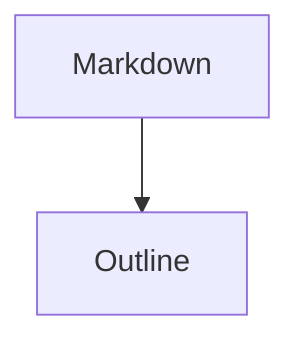

# Outline Fixture

This document exercises the right-side outline panel.

## Heading Navigation

The outline should show headings with hierarchy and jump to them quickly.

### Nested Heading

Nested headings should be indented enough to scan without becoming fussy.

## Tables

| Landmark | Expected |
|---|---|
| Table | Appears in outline |
| Code block | Appears in outline |

## Code

```swift
struct PreviewState {
    let title: String
}
```

## Quote

> A block quote can act as a document landmark when scanning.

## Diagram



## Image


